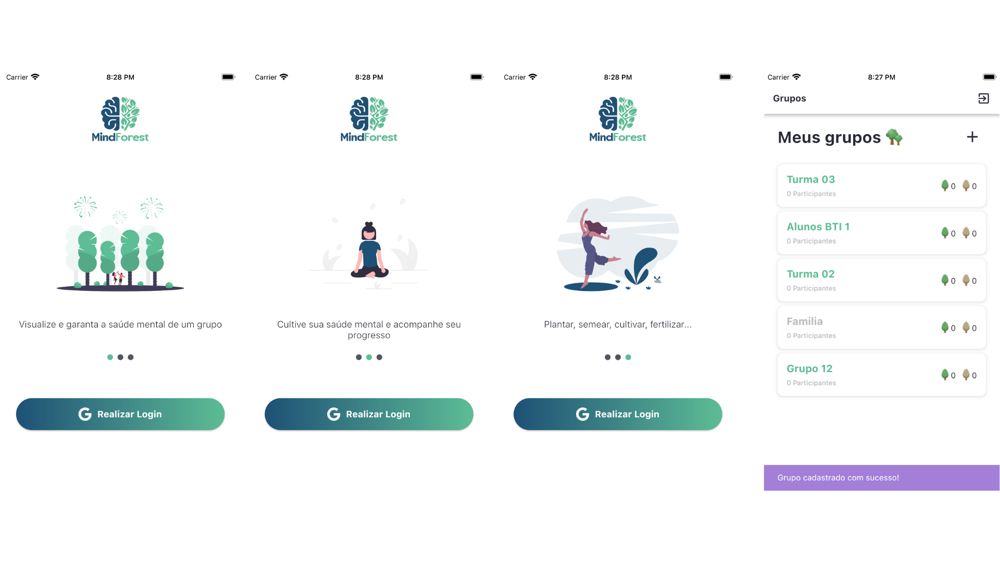

An app to map mental health for an individual or for a group

---

---

# 🏛️ Architecture
This apps uses a MicroFrontends (multi-package) approach with Clean Arch. _They aren't silver bullets._

# :bug: Issues

Feel free to **file a new issue** with a respective title and description. If you already found a solution to your problem, **I would love to review your pull request**!

# :tada: Contributing

Check out the [contributing](https://github.com/felipekjr/mindforest/blob/main/CONTRIBUTING.md) page to see the best places to file issues, start discussions and begin contributing.
